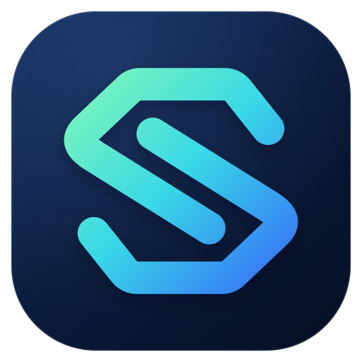

**社区地址：[macos.do](https://macos.do)**

**TG 交流群：[t.me/macosdo](https://t.me/macosdo)**

<div align="center">



# Sub4API

**兼容 sub2api，增强 Codex 使用体验**

</div>

Sub4API 基于 sub2api 二次开发，完全兼容 sub2api，并会持续同步合并 sub2api 的版本更新。

在原有 API 网关与账号管理能力的基础上，Sub4API 重点增强 **Codex 打票与票据管理、请求时区替换以及请求头语言统一**，并提供票据流水和降智检测，方便管理与排查账号状态。

已部署 sub2api 的用户，只需将应用镜像替换为 `macosdo/sub4api:latest` 并重新创建应用容器，即可沿用原有配置与数据切换到 Sub4API。

## 相比 sub2api 的主要改进

### 1. Codex 打票与票据管理

为支持的 OpenAI OAuth 类账号和模型获取、校验并使用票据，支持自动打票和手动打票，以及按账号、按模型管理参与打票的范围。

- **模型指纹校验**：结合模型指纹校验打票结果，保存可用票据供后续请求使用。
- **打票代理池**：复用「IP 设置」中的可用代理，支持使用全部可用代理或自定义选择，并在池内轮换；没有可用代理时不会直接连接打票。
- **失败重试与主动刷新**：失败后按配置的间隔随机重试；主动刷新默认每 30 分钟一次，可调整间隔，设置为 `0` 可关闭主动刷新。
- **票据与流水**：集中查看当前票据、打票成功与失败流水、票据失效历史。打票流水与失效历史均保留最近 90 天。
- **多模型降智检测**：可选择多个模型，依次通过正式请求链路检测，查看正常、疑似降智、不确定或失败等结果。检测会产生正常请求费用，结果用于辅助排查。

**使用入口：**

| 功能 | 后台入口 |
| --- | --- |
| 打票总开关、重试与刷新间隔 | 系统设置中的「Codex 设置」，开启「292 打票」并保存设置 |
| 打票代理池 | 「IP 设置」中的「Codex 打票代理池」 |
| 账号与模型打票、票据流水 | 「账号管理」中点击账号的「打票」列，进入票据中心 |
| 降智检测 | 票据中心的「降智检测」页，或账号操作菜单中的「降智检测」 |

### 2. 请求时区替换

OpenAI 账号可以单独设置请求时区，默认使用新加坡时区 `Asia/Singapore`。转发请求时，会按账号配置统一请求中的环境日期与时区。

- 仅处理明确标记为环境上下文的内容，替换其中已有的 `timezone`，并按目标时区更新已有的 `current_date`。
- 同步替换网页搜索工具中已有的 `user_location.timezone`。
- 普通对话文本不会被全局替换，也不会修改服务器或数据库的时区。
- 可选时区列表不包含中国大陆和港澳台时区。

例如，账号使用默认时区，且新加坡当前日期为 `2026-09-24` 时，以下已标记的环境上下文：

```xml
<environment_context>
  <current_date>2026-09-23</current_date>
  <timezone>America/New_York</timezone>
</environment_context>
```

转发时会更新为：

```xml
<environment_context>
  <current_date>2026-09-24</current_date>
  <timezone>Asia/Singapore</timezone>
</environment_context>
```

**使用入口：** 在「账号管理」中创建或编辑 OpenAI 账号，通过「请求时区」选择目标时区并保存。

### 3. 请求头语言替换

转发 OpenAI 上游请求时，将已有的 `Accept-Language` 请求头统一为：

```http
Accept-Language: en-US,en;q=0.9
```

原请求没有该请求头时，不会主动添加。该处理只统一请求头中的语言偏好，不会翻译用户消息，也不会强制模型使用英文回答。

**使用方式：** 随 OpenAI 账号的请求转发自动处理，无需额外配置。

## 部署与切换

Docker 镜像统一使用 `macosdo/sub4api:latest`。为沿用现有部署配置，Compose 服务名和 Linux 安装脚本的 systemd 服务名仍为 `sub2api`。

### 从 sub2api 一键切换到 Sub4API

在原部署目录中操作，继续使用原来的 Compose 文件和项目名。切换前按原部署方式备份数据库与配置。

**第一步：修改应用镜像。**

找到现有 Compose 文件中的 `sub2api` 服务，将 `image` 改为：

```yaml
services:
  sub2api:
    image: macosdo/sub4api:latest
```

上面仅展示需要修改的片段，其余配置继续沿用。保留原服务名、端口、数据目录与数据卷，以及原 `.env` 中的数据库、Redis 连接、`JWT_SECRET` 和 `TOTP_ENCRYPTION_KEY`，无需重新初始化或导入账号。

**第二步：一条命令拉取镜像并更新应用容器。**

```bash
docker compose pull sub2api && docker compose up -d --no-deps sub2api
```

该命令只更新应用服务，继续使用现有 PostgreSQL 和 Redis 服务。

如果原来使用 `docker-compose.local.yml`，继续带上相同的 `-f` 参数：

```bash
docker compose -f docker-compose.local.yml pull sub2api && docker compose -f docker-compose.local.yml up -d --no-deps sub2api
```

如果原命令还使用了 `-p`、`--env-file` 或多个 `-f` 参数，切换及后续维护时也应保留这些参数，确保使用原有配置与数据卷。

**第三步：确认启动结果。**

```bash
docker compose ps sub2api
docker compose logs --tail=100 sub2api
```

使用自定义 Compose 参数时，上面的检查命令也应带上相同参数。服务启动后，访问原管理后台地址，使用原管理员账号登录并确认账号与数据正常。

### Docker Compose 部署

适合首次部署，默认配置包含应用、PostgreSQL 18 和 Redis 8。需要 Docker、Docker Compose v2 或更新版本，以及 `curl` 和 `openssl`。

#### 准备配置

```bash
mkdir -p sub4api-deploy
cd sub4api-deploy

# 下载 Compose 配置并生成首次部署所需的密钥和数据目录
curl -fsSL https://raw.githubusercontent.com/MACOS-DO/sub4api/main/deploy/docker-deploy.sh | bash
chmod 600 .env
```

脚本将下载 `docker-compose.local.yml` 并保存为 `docker-compose.yml`，同时生成 `.env`、数据库密码、JWT 密钥和 TOTP 加密密钥。已有 sub2api 实例请使用前面的切换步骤。

打开生成的 `docker-compose.yml`，将 `sub2api` 服务的镜像改为：

```yaml
image: macosdo/sub4api:latest
```

随后检查 `.env`，按需设置 `ADMIN_EMAIL`、`ADMIN_PASSWORD` 和 `SERVER_PORT`。这里仅修改应用镜像，其余服务及数据挂载保持生成的配置。

#### 启动与首次登录

```bash
docker compose up -d
docker compose ps
docker compose logs -f sub2api
```

浏览器访问 `http://服务器IP:8080`；如果修改了 `SERVER_PORT`，使用对应端口。Docker 部署会根据环境变量自动完成初始化。

使用 `.env` 中设置的管理员邮箱与密码登录。如果 `ADMIN_PASSWORD` 留空，首次初始化会生成密码，可在应用启动日志中查看。

#### 升级与查看日志

```bash
# 拉取最新应用镜像并重新创建应用容器
docker compose pull sub2api && docker compose up -d --no-deps sub2api

# 查看最近的应用日志
docker compose logs --tail=100 sub2api

# 持续查看应用日志
docker compose logs -f sub2api
```

### Linux 脚本安装

适用于 amd64 或 arm64 Linux 服务器。需要 Bash 4 或更新版本、root 或 sudo 权限，以及可连接的 PostgreSQL 和 Redis。

```bash
curl -fsSL https://raw.githubusercontent.com/MACOS-DO/sub4api/main/deploy/install.sh | sudo bash

# 启动服务并设置开机启动
sudo systemctl enable --now sub2api
```

安装脚本从本项目的 GitHub Releases 下载程序，安装目录为 `/opt/sub2api`，服务名为 `sub2api`。首次访问 `http://服务器IP:8080`，按向导配置数据库、Redis 和管理员账号。

常用管理命令：

```bash
# 查看运行状态
sudo systemctl status sub2api

# 查看日志
sudo journalctl -u sub2api -f

# 重启服务
sudo systemctl restart sub2api
```

### 源码编译

需要 Go 1.27.0、Node.js 24、pnpm 9，以及可连接的 PostgreSQL 和 Redis。Go 版本与当前 `backend/go.mod` 一致，Node.js 与 pnpm 版本与仓库 Docker 构建保持一致。

```bash
git clone https://github.com/MACOS-DO/sub4api.git
cd sub4api

# 安装 pnpm 并构建前端
npm install --global pnpm@9
cd frontend
pnpm install --frozen-lockfile
pnpm run build

# 构建后端，将前端资源嵌入程序
cd ../backend
VERSION="$(./scripts/resolve-version.sh)"
go build -tags embed -ldflags="-X main.Version=${VERSION}" -o sub4api ./cmd/server

# 首次运行，进入初始化向导
./sub4api
```

访问 `http://localhost:8080`，通过向导设置数据库、Redis 和管理员账号，并生成 `config.yaml`。首次安装时应由向导生成配置，提前复制配置文件会跳过初始化向导。

初始化完成后，可参考 [完整配置示例](deploy/config.example.yaml) 调整配置。`-tags embed` 用于嵌入前端资源，提供管理界面。

### macOS Apple container

适用于搭载 Apple 芯片、运行 macOS 26 或更新版本的 Mac，需要 Apple `container` 1.1.0 或更新版本及 `openssl`。

```bash
git clone https://github.com/MACOS-DO/sub4api.git
cd sub4api/deploy

# 生成首次部署配置
./apple-container.sh init
```

编辑生成的 `.env`，设置应用镜像：

```dotenv
APPLE_CONTAINER_SUB2API_IMAGE=macosdo/sub4api:latest
```

随后启动并检查服务：

```bash
./apple-container.sh up
./apple-container.sh status
./apple-container.sh logs app
```

浏览器访问 `http://localhost:8080`。完整的生命周期命令、数据持久化、升级方式和运行限制见 [Apple container 部署说明](deploy/APPLE_CONTAINER.md)，应用镜像使用上面的 Sub4API 配置。

### 常用配置与维护

#### 环境变量

Docker Compose 使用部署目录下的 `.env`。常用配置如下：

| 配置项 | 用途 |
| --- | --- |
| `POSTGRES_PASSWORD` | PostgreSQL 密码；首次部署脚本自动生成，已有实例沿用原值 |
| `JWT_SECRET` | 登录令牌签名密钥，升级或切换时保留原值 |
| `TOTP_ENCRYPTION_KEY` | 双重验证加密密钥，升级或切换时保留原值 |
| `ADMIN_EMAIL` / `ADMIN_PASSWORD` | 首次初始化时创建管理员所用的邮箱和密码 |
| `SERVER_PORT` | 对外访问端口，默认 `8080` |
| `BIND_HOST` | 宿主机监听地址 |

应用配置项见 [配置示例](deploy/config.example.yaml)，Docker 环境变量见 [环境变量示例](deploy/.env.example)。账号的「请求时区」仅作用于发往上游的请求，与服务器时区配置分别管理。

#### 备份与迁移

上面的新部署脚本使用本地目录保存应用、PostgreSQL 和 Redis 数据。对于这种部署方式，可以先停止服务，再备份整个部署目录，包含 `.env` 和数据目录：

```bash
# 在 sub4api-deploy 目录中执行
docker compose stop
cd ..
sudo tar -czf "sub4api-backup-$(date +%Y%m%d-%H%M%S).tar.gz" sub4api-deploy/

# 备份完成后恢复原服务
cd sub4api-deploy
docker compose start
```

迁移到新服务器时，复制并解压备份，保留原 `.env`、目录结构和数据库及 Redis 版本，在部署目录执行 `docker compose up -d`。使用自定义 Compose 参数时继续沿用原参数。

使用具名数据卷或外部数据库的实例，需要同时备份对应数据卷或数据库；仅备份部署目录不包含这些数据。

#### Nginx 请求头配置

使用 Nginx 反向代理并接入 Codex 客户端时，在 Nginx 的 `http` 配置块中启用：

```nginx
underscores_in_headers on;
```

这样可以保留 `session_id` 等带下划线的请求头，供粘性会话路由使用。修改后检查 Nginx 配置并重新加载。

## 致谢与许可证

感谢 sub2api 项目及其贡献者提供的基础能力。Sub4API 将持续同步合并上游版本更新，并在此基础上维护本项目的增强功能。

本项目采用 [GNU LGPL v3.0 或更高版本](LICENSE) 许可证。

Copyright (c) 2026 Wesley Liddick
